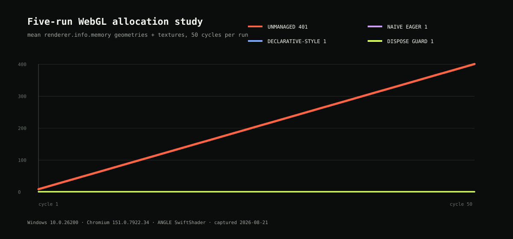

# three-dispose-guard

Ownership-aware GPU resource disposal for Three.js and React Three Fiber.

**[Open the live lab](https://three-dispose-guard.vercel.app)** to run the six proofs in your own browser.

[](https://github.com/OskarasM/three-dispose-guard/actions/workflows/ci.yml)
[](https://www.npmjs.com/package/three-dispose-guard)
[](LICENSE)

Three.js resources are explicit. JavaScript garbage collection does not release their GPU allocations, but disposing every object on unmount is unsafe when another component or cache still owns it.

`three-dispose-guard` makes that ownership visible:

- **Owned** resources become disposal candidates after their final user releases them.
- **Borrowed** resources are tracked but never claimed for disposal.
- **Protected** resources outlive component users until a cache or pool is explicitly evicted.
- **Audit mode** reports what would happen without mutating a GPU resource.

The core has zero runtime dependencies. React, Three.js and React Three Fiber are optional peer dependencies used only by their respective entry points.

## When to use it

Use the guard when at least one of these is true:

- Two mounted objects share a geometry, material, texture or skeleton.
- An R3F `useLoader` result must survive zero mounted consumers.
- A `<primitive>` object is cached or shared outside one component.
- Imperative Three.js objects move between screens, pools or renderers.
- You need named, testable disposal diagnostics before enabling cleanup.

Do not add it to every R3F scene by default. React Three Fiber already attempts to dispose declarative objects on unmount. Unique objects with obvious component ownership usually need no additional registry.

## Install

```bash
npm install three-dispose-guard
```

Three.js is a required peer dependency. React and React Three Fiber are optional peers, needed only if you import the `/react` or `/r3f` entry points.

| Peer | Range | Required |
|---|---|---|
| `three` | `>=0.163 <1` | Yes |
| `react` | `>=18 <20` | Only for `three-dispose-guard/react` and `/r3f` |
| `@react-three/fiber` | `>=8 <10` | Only for `three-dispose-guard/r3f` |

The package declares `engines.node: >=20`, which matches the Node versions covered by CI.

## R3F quick start

```tsx
import { Suspense } from 'react'
import { Canvas } from '@react-three/fiber'
import { GLTFLoader } from 'three/examples/jsm/loaders/GLTFLoader.js'
import { createResourceRegistry } from 'three-dispose-guard'
import {
  createR3FResourceCache,
  GuardedPrimitive,
  R3FResourceCacheProvider,
  useGuardedLoader,
} from 'three-dispose-guard/r3f'

const registry = createResourceRegistry({ mode: 'audit' })
const cache = createR3FResourceCache({ registry })

function ProductModel() {
  const gltf = useGuardedLoader(GLTFLoader, '/shoe.glb')
  return <GuardedPrimitive object={gltf.scene} />
}

export function ProductViewer() {
  return (
    <R3FResourceCacheProvider cache={cache}>
      <Canvas>
        <Suspense fallback={null}>
          <ProductModel />
        </Suspense>
      </Canvas>
    </R3FResourceCacheProvider>
  )
}

// Eviction is your application's decision, made at a point in its own
// lifecycle. Do not run it at module load, as this example previously implied.
export function releaseProductAssets() {
  cache.evict(GLTFLoader, '/shoe.glb')
}
```

Start in audit mode and inspect `registry.snapshot().events`. Switch to `{ mode: 'dispose' }` only after the recorded ownership matches the application.

`GuardedPrimitive` always supplies `dispose={null}` so R3F does not compete with the registry. Use `cache.preload`, `cache.evict` and `cache.clear`; do not call `useLoader.clear` directly for guarded entries.

## Imperative Three.js

```ts
import { createResourceRegistry } from 'three-dispose-guard'

const registry = createResourceRegistry({ mode: 'dispose' })

const first = registry.acquire(model, {
  ownership: 'owned',
  label: 'product card A',
})

const second = registry.acquire(model, {
  ownership: 'owned',
  label: 'product card B',
})

first.release()   // shared resources remain usable
second.release()  // final owner releases, disposal occurs
```

For an external cache:

```ts
const cacheProtection = registry.protect(gltf, { label: 'GLTF cache' })
const mountedUser = registry.acquire(gltf, { ownership: 'borrowed' })

mountedUser.release()      // cache still owns the result
cacheProtection.release() // eviction permits final disposal
```

## Measured result

The committed reference run was captured on 21 August 2026 using Chromium 151, Windows 10.0.26200 and ANGLE SwiftShader. It discarded a four-cycle warm-up, then ran five independent 50-cycle measurements.

| Strategy | Final resources in each run | Mean | Variance |
|---|---:|---:|---:|
| Unmanaged | 401, 401, 401, 401, 401 | 401 | 0 |
| Naive eager disposal | 1, 1, 1, 1, 1 | 1 | 0 |
| Declarative-style disposal | 1, 1, 1, 1, 1 | 1 | 0 |
| Dispose Guard | 1, 1, 1, 1, 1 | 1 | 0 |



This unique-resource scenario deliberately shows a negative result for the package: when ownership is simple, all explicit cleanup strategies work. The guard's additional value is demonstrated by the shared-handle, cache-reuse, Canvas-remount, churn and in-flight proofs, all of which passed in the captured browser run.

The signal is `renderer.info.memory.geometries + renderer.info.memory.textures`. It is a Three.js resource count, not a measurement of GPU bytes.

## Six reproducible scenarios

| Scenario | Question answered | Captured result |
|---|---|---|
| Unique resources | Does allocation grow when disposal is omitted? | Unmanaged grew; all explicit strategies stayed flat |
| Two live users | Does the first release destroy shared GPU state? | No, the WebGL texture survived |
| Loader cache reuse | Can the asset survive zero mounted users and be reused? | Yes, until explicit eviction |
| Canvas remount | Are scene and renderer lifecycles separated? | Yes, both cleanup responsibilities passed |
| Shared churn | Does repeated hand-off over-dispose? | No, one final disposal occurred |
| In-flight eviction | Does a late result return to an evicted cache? | No, the stale result was cleaned |

The complete captured data is available as
[JSON](https://github.com/OskarasM/three-dispose-guard/blob/main/benchmarks/results/2026-08-21-windows-chromium.json) and
[CSV](https://github.com/OskarasM/three-dispose-guard/blob/main/benchmarks/results/2026-08-21-windows-chromium.csv).
Raw measurement data is not shipped in the npm tarball.

## Reproduce the study

```bash
npm ci
npx playwright install chromium

npm run check
npm run test:browser
npm run benchmark:capture
npm run benchmark:chart
```

`npm run benchmark:capture` starts an isolated local Vite server, launches Chromium, discards the warm-up, records five 50-cycle runs and writes host metadata alongside every raw sample. `npm run benchmark:chart` derives the committed SVG from that JSON.

Browser and driver resource behaviour varies. A new environment should produce a new dated result rather than overwrite or generalise the reference capture.

## Public API

### `three-dispose-guard`

| Export | Purpose |
|---|---|
| `createResourceRegistry(options)` | Creates an audit or disposal registry |
| `registry.acquire(root, options)` | Tracks an owned or borrowed lifetime |
| `registry.protect(root, options)` | Anchors a cache, pool or external owner |
| `registry.snapshot()` | Returns immutable counts, scopes and events |
| `registry.subscribe(listener)` | Observes snapshot changes |
| `registry.flush()` | Immediately processes microtask-scheduled releases |
| `collectDisposableResources(root)` | Collects standard Three.js disposable resources |

Imperative leases default to `releasePolicy: 'immediate'`. React helpers default to `'microtask'` so a same-tick Strict Mode effect replay can reclaim the resource before disposal.

### `three-dispose-guard/react`

| Export | Purpose |
|---|---|
| `ResourceRegistryProvider` | Supplies one registry to a React subtree |
| `useResourceLease` | Acquires and releases a stable root with component lifetime |
| `useResourceRegistry` | Reads the supplied registry |
| `useResourceSnapshot` | Subscribes with `useSyncExternalStore` |

### `three-dispose-guard/r3f`

| Export | Purpose |
|---|---|
| `createR3FResourceCache` | Coordinates registry protection with R3F loader cache keys |
| `R3FResourceCacheProvider` | Supplies one cache guard |
| `useGuardedLoader` | Mirrors `useLoader` and borrows the resolved result |
| `GuardedPrimitive` | Renders an R3F primitive with `dispose={null}` |
| `useR3FResourceCache` | Reads the supplied cache guard |

See [the API reference](docs/api.md), [R3F guide](docs/r3f-guide.md), [ownership model](docs/ownership-model.md) and [measurement methodology](docs/methodology.md).

## Custom collectors

Built-in collection covers Object3D trees, geometry and material arrays, texture-valued material properties and uniforms, scenes, skeletons, render targets and common GLTF result fields.

Application-specific containers can add resources without replacing the built-in collector:

```ts
const registry = createResourceRegistry({
  mode: 'dispose',
  collectors: [
    (root) => isEffectComposerBundle(root)
      ? root.passes.filter((pass) => typeof pass.dispose === 'function')
      : [],
  ],
})
```

A render target is treated as the owner of its attachments, so the target and its textures are not disposed twice.

## Diagnostics

`registry.snapshot()` includes:

- Active leases and protections, with labels and ownership.
- Tracked, pending, protected, owned and borrowed resource counts.
- Exact counts for geometry, material, texture, render target, skeleton and custom resources.
- Immutable lifecycle events: `acquired`, `released`, `protected`, `unprotected`, `disposed`, `would-dispose`, `disposal-scheduled`, `disposal-cancelled` and `dispose-error`.

Disposal exceptions are reported through both diagnostics and the optional `onError` callback. Cleanup then continues for the remaining resources.

## What this cannot solve

- `renderer.info` does not expose GPU byte usage.
- The package does not own `WebGLRenderer.dispose()` or browser context loss.
- It cannot infer an application-specific cache eviction policy.
- Direct disposal by another library cannot be intercepted.
- A resource with no `dispose()` capability remains outside the guarantee.
- WebGPU measurement is outside the `0.1.0` scope.
- FinalizationRegistry is intentionally not used because garbage-collection timing is nondeterministic and does not express ownership.

## Development

```bash
npm ci
npm run typecheck
npm test
npm run build
npm run demo:build
npm run test:browser
```

The package is tested as ESM and CommonJS, with TypeScript declarations and independent core, React and R3F entry points.

## Contributing and security

Read [CONTRIBUTING.md](CONTRIBUTING.md) before opening a change. Report vulnerabilities privately as described in [SECURITY.md](SECURITY.md); do not include exploit details in a public issue.

## Related

Two other pieces of the same problem, built in the open:

- [scene-narrator](https://github.com/OskarasM/scene-narrator) makes a moving
  Three.js scene usable with a screen reader without spending the frame budget
  on it. [Demo](https://scene-narrator-demo.vercel.app)
- [realtime-3d-room](https://github.com/OskarasM/realtime-3d-room) is a shared
  3D room over Supabase Realtime, with a written guide to why presence cannot
  carry position. [Demo](https://realtime-3d-room.vercel.app)

## Licence

MIT © Oskaras Margevicius

The site self-hosts four typefaces, all under the SIL Open Font License 1.1.
Their licence texts ship beside the files in `demo/public/fonts/`.
